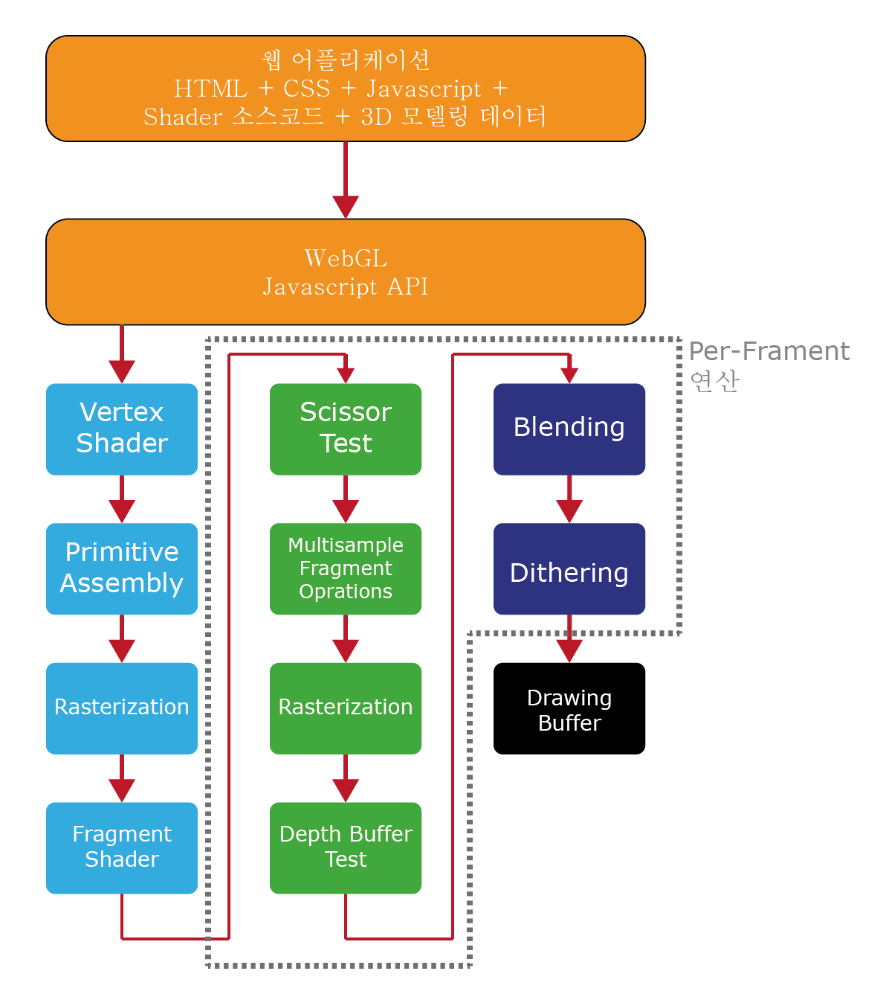
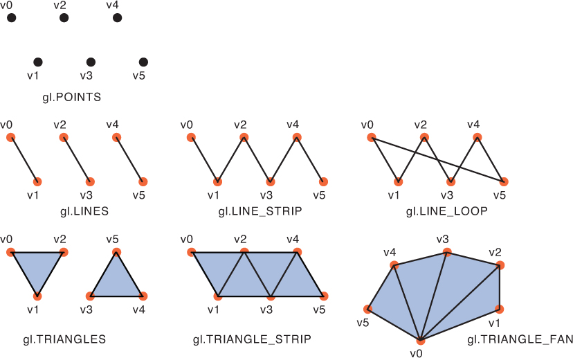

## [용어](https://webglfundamentals.org/webgl/lessons/ko/webgl-fundamentals.html)

- ##### WebGL

  > Web Graphics Library, OpenGL ES 2.0을 대부분 충족하는 API를 제공
  >
  > 대부분의 WebGL API는 함수 쌍 실행을 위한 상태 설정에 관한 것입니다. 당신이 원하는 것을 그리기 위해서는 여러 상태를 설정하고 GPU에서 Shader를 실행하는 `gl.drawArrays` 또는 `gl.drawElements`을 실행해야 합니다.

- ##### Vertex Shader

  > Vertex Shader의 역할은 Vertex 위치들을 계산하는 겁니다. 출력 위치에 따라서 WebGL은 점, 선, 삼각형을 포함한 다양한 종류의 Primitive를 Rasterization 할 수 있습니다. 이 Primitive들을 rasterization하면 Fragment Shader 함수를 두 번째로 호출합니다. 

- ##### Fragment Sahder

  > Fragment Shader의 역할은 현재 그려진 Primitive의 모든 화소에 색을 계산하는 겁니다.

- ##### Buffer

  > Buffer는 GPU에 올리는 2진 데이터 배열입니다. 일반적으로 Buffer는 위치, 법선, Texture 좌표, Vertex 색상 등을 포함하지만 당신이 원하는 것을 자유롭게 넣어도 됩니다.

- ##### Attribute

  > Attribute는 어떻게 Buffer에서 데이터를 가져오고 Vertex Shader에 제공할지 방법을 지정하는데 사용됩니다. 예를 들어 3개의 32bit 부동 소수점으로 각각의 위치를 buffer에 넣을 수 있는데요. 특정한 Attribute에게 어느 Buffer에서 위치를 가져올지, 어떤 데이터 형식을 가져와야 하는지 (3개의 32bit 부동 소수점), Buffer의 어디에서 offset이 시작되는지 그리고 한 위치에서 다음 위치로 얼마나 많은 바이트를 이동시킬 것인지 알려줘야 합니다.

- ##### Uniform

  > Uniform은 Shader Program을 실행하기 전에 선언하는 유용한 전역 변수입니다.

- ##### Texture

  > Texture는 Shader Program이 무작위로 접근할 수 있는 데이터 배열입니다. 일반적으로 Texture에 들어가는 것은 대부분 이미지 데이터지만 색상 이외에 다른 것도 쉽게 넣을 수 있습니다.

- ##### Varying

  > Varying는 Vertex Shader가 Fragment Shader에 데이터를 넘기는 방법입니다. 렌더링 되는 점, 선 또는 삼각형에 따라 Vertex Shader의 Varying 값은 Fragment Shader를 실행하는 동안 보간됩니다.

- ##### precision

  > 정밀도 'lowp, 'mediump' or 'highp'

- ##### Frame Buffer (Drawing Buffer)

  > 그래픽 데이터가 GPU의 파이프라인을 순회할 때, 마지막으로 도착하는 곳이 프레임 버퍼. 프레임 버퍼는 화면에 그려지는 최종 이미지 정보를 담고 있는 메모리. 프레임 버퍼는 다음과 같이 적어도 세 개의 하부 버퍼들로 구성.

  - ###### Color Buffer: 색상과 투명도 정보

    > 색상 버퍼는 RGB나 RGBA 포맷으로 표현되는 색상 정보를 담고 있는 스크린상의 각 픽셀 정보를 저장하는 직사각형 형태의 메모리 구조.

  - ###### Z Buffer: Depth Buffer, 각 픽셀의 앞면과 뒷면을 나타내는 심도 정보

    > 가려진 오브젝트를 판별을 위해 그래픽 하드웨어는 깊이 버퍼라 불리는 Z 버퍼의 지원을 받는다. Z 버퍼는 색상 버퍼와 같은 수의 픽셀을 가지고 있다. Z 버퍼는 각 픽셀마다 관찰자와 가장 가까운 프리미티브의 거리를 저장한다.

  - ###### Stencil Buffer: 랜더링 영역의 경계정보 (영역만 랜더링)

    > 가장 간단한 경우, 렌더링 영역 (스텐실 링) 을 제한하는데 사용. 스텐실 버퍼의 고급 사용은 특수 효과를 생성하기 위해 이미지의 마수크 픽셀에 사용. 마스크 픽셀은 픽셀을 그릴지 여부를 제어. 이러한 특수 효과에는 합성, 데칼, 디졸브, 페이드, 스와이프, 아웃라인과 실루엣, 양면 스텔실이 포함

- ##### Double Buffering

  

  - 일반적으로 비디오 카드에서 Frame Buffer는 2중 포트(Dual Port) 구조
  - 한쪽은 GPU, 다른 한쪽은 Video Controller.
  - GPU는 그려질 화면을 프레임버퍼에 쓰는 일을, Video Controller는 프레임버퍼에 그려진 화면을 출력하는 일을 한다.

  

  - Flickering(깜빡거림) 현상을 해결하기 위해 더블 버퍼링을 사용
  - Video Controller가 프론트버퍼의 내용을 출력하는 동안, GPU는 백버퍼에 백버퍼에 다음에 그려질 내용을 쓴다. 
  - GPU가 전부 내용을 썼으면 비디오 컨트롤러가 백버퍼로 스위칭 후 새로운 내용을 화면에 그린다.
  - 동시에 GPU는 프론트버퍼로 스위칭, 새로 화면에 그릴 내용을 버퍼에 쓴다.

  출처: [더블버퍼링]([https://huiyu.tistory.com/entry/%EC%BB%B4%ED%93%A8%ED%84%B0-%EA%B7%B8%EB%9E%98%ED%94%BD%EC%8A%A4-%EC%9D%B4%EB%A1%A0-%EC%A0%95%EB%A6%AC-%EB%8D%94%EB%B8%94%EB%B2%84%ED%8D%BC%EB%A7%81Double-Buffering?category=476980](https://huiyu.tistory.com/entry/컴퓨터-그래픽스-이론-정리-더블버퍼링Double-Buffering?category=476980))

- ##### Vidoe Controller

  > Video Generator, 비디오 컨트롤러(혹은 비디오 제네레이터)는 색상 버퍼를 라인 단위로 일정 주기로 훑으며 화면을 갱신한다. LCD 디스플레이에서 전체 화면은 보통 초당 60회 갱신된다. 이를 60Hz의 주사율을 가지고 있다고 한다.

- ##### WebGL Graphic Pipe Line

  > 데이터가 완전히 웹지엘 파이프라인을 순회하고 나면, 결과는 그리기 버퍼에 쓰여진다. 이 그리기 버퍼를 일반적으로 웹지엘의 프레임 버퍼라 생각하면 된다. 그리기 버퍼는 프레임 버퍼와 같이 색상 버퍼, Z 버퍼, 스텐실 버퍼를 포함한다. 그러나 **그리기 버퍼의 결과는 화면에 그려질 정보를 저장하는 물리적인 버퍼에 그려지기 전에 나머지 HTML 페이지의 내용과 결합된다.**

  - ###### 웹 애플리케이션 

    > HTML + CSS + JS + 쉐이더 소스 + 3차원 모델링 데이터

  - ###### WebGL

  - ###### 버텍스 쉐이더

  - ###### 프리미티브 어셈블리

  - ###### 래스터화

  - ###### 프래그먼트 쉐이더

  - ###### 프래그먼트당 연산 과정

    - 가위 테스트
    - 멀티샘플 프래그먼트 연산
    - 스텐실 테스트
    - 깊이 버퍼 테스트
    - 블렌딩
    - 디더링
    - 그리기 버퍼

  

- ##### Primitive Type

  > 7가지 기본 Vertex 타입

  - POINTS
  - LINES
  - LINE_STRIP
  - LINE_LOOP
  - TRIANGLES
  - TRIANGLS_STRIP
  - TRIANGLE_FAN

  

  출처: [Drawing and Transforming Triangles in WebGL](http://www.informit.com/articles/article.aspx?p=2111395&seqNum=2)

  

- ##### clip 공간 좌표

  > canvas 크기에 상관없이 항상 `-1`에서 `+1`까지 사용

  

출처: [WebGL 기초](https://webglfundamentals.org/webgl/lessons/ko/webgl-fundamentals.html)

