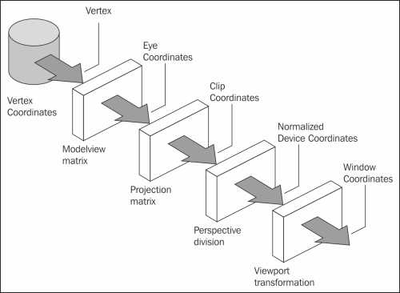
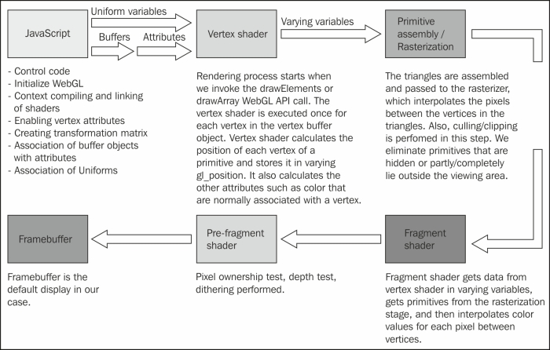
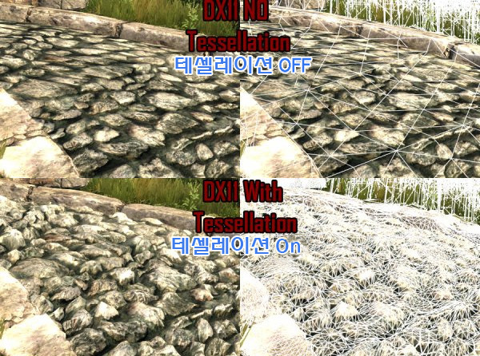

## [용어](https://webglfundamentals.org/webgl/lessons/ko/webgl-fundamentals.html)

- ##### WebGL

  > Web Graphics Library, OpenGL ES 2.0을 대부분 충족하는 API를 제공
  >
  > 대부분의 WebGL API는 함수 쌍 실행을 위한 상태 설정에 관한 것입니다. 당신이 원하는 것을 그리기 위해서는 여러 상태를 설정하고 GPU에서 Shader를 실행하는 `gl.drawArrays` 또는 `gl.drawElements`을 실행해야 합니다.

- ##### Vertex Shader

  > Vertex Shader의 역할은 Vertex 위치들을 계산하는 겁니다. 출력 위치에 따라서 WebGL은 점, 선, 삼각형을 포함한 다양한 종류의 Primitive를 Rasterization 할 수 있습니다. 이 Primitive들을 rasterization하면 Fragment Shader 함수를 두 번째로 호출합니다. 

- ##### Fragment Sahder

  > Fragment Shader의 역할은 현재 그려진 Primitive의 모든 화소에 색을 계산하는 겁니다.

- ##### Buffer

  > Buffer는 GPU에 올리는 2진 데이터 배열입니다. 일반적으로 Buffer는 위치, 법선, Texture 좌표, Vertex 색상 등을 포함하지만 당신이 원하는 것을 자유롭게 넣어도 됩니다.

- ##### Attribute

  > Attribute는 어떻게 Buffer에서 데이터를 가져오고 Vertex Shader에 제공할지 방법을 지정하는데 사용됩니다. 예를 들어 3개의 32bit 부동 소수점으로 각각의 위치를 buffer에 넣을 수 있는데요. 특정한 Attribute에게 어느 Buffer에서 위치를 가져올지, 어떤 데이터 형식을 가져와야 하는지 (3개의 32bit 부동 소수점), Buffer의 어디에서 offset이 시작되는지 그리고 한 위치에서 다음 위치로 얼마나 많은 바이트를 이동시킬 것인지 알려줘야 합니다.

- ##### Uniform

  > Uniform은 Shader Program을 실행하기 전에 선언하는 유용한 전역 변수입니다.

- ##### Texture

  > Texture는 Shader Program이 무작위로 접근할 수 있는 데이터 배열입니다. 일반적으로 Texture에 들어가는 것은 대부분 이미지 데이터지만 색상 이외에 다른 것도 쉽게 넣을 수 있습니다.

- ##### Varying

  > Varying는 Vertex Shader가 Fragment Shader에 데이터를 넘기는 방법입니다. 렌더링 되는 점, 선 또는 삼각형에 따라 Vertex Shader의 Varying 값은 Fragment Shader를 실행하는 동안 보간됩니다.

- ##### Attributes, Uniforms, Varyings, Vertex Buffer Objects 관계

  

  출처: [What is WebGL - Graphics Pipeline?](https://www.wisdomjobs.com/e-university/webgl-tutorial-1269/webgl-graphics-pipeline-16662.html)

- ##### primitive

  > 버텍스 셰이더 이후의 파이프라인 단계에서는 개별적으로 셰이딩된 버텍스를 조립해 삼각혀이나, 선, 포인트 스파라이트 등의 기하 **프리미티브**를 생성.  Primitive의 사전적 의미는 원시적인 기초적인 이란 의미이며, 여기서는 '원형'이란 의미 로 사용. 그래픽스라면 폴리곤이나 기본 도형 같을걸 말함. 충돌검사일 때는 큐브나 타원체, 구 등 충돌 대상이 되는 원형을 의미.

- ##### precision

  > 정밀도 'lowp, 'mediump' or 'highp'

- ##### Frame Buffer (Drawing Buffer)

  > 그래픽 데이터가 GPU의 파이프라인을 순회할 때, 마지막으로 도착하는 곳이 프레임 버퍼. 프레임 버퍼는 화면에 그려지는 최종 이미지 정보를 담고 있는 메모리. 프레임 버퍼는 다음과 같이 적어도 세 개의 하부 버퍼들로 구성.

  - ###### Color Buffer: 색상과 투명도 정보

    > 색상 버퍼는 RGB나 RGBA 포맷으로 표현되는 색상 정보를 담고 있는 스크린상의 각 픽셀 정보를 저장하는 직사각형 형태의 메모리 구조.

  - ###### Z Buffer: Depth Buffer, 각 픽셀의 앞면과 뒷면을 나타내는 심도 정보

    > 가려진 오브젝트를 판별을 위해 그래픽 하드웨어는 깊이 버퍼라 불리는 Z 버퍼의 지원을 받는다. Z 버퍼는 색상 버퍼와 같은 수의 픽셀을 가지고 있다. Z 버퍼는 각 픽셀마다 관찰자와 가장 가까운 프리미티브의 거리를 저장한다.

  - ###### Stencil Buffer: 랜더링 영역의 경계정보 (영역만 랜더링)

    > 가장 간단한 경우, 렌더링 영역 (스텐실 링) 을 제한하는데 사용. 스텐실 버퍼의 고급 사용은 특수 효과를 생성하기 위해 이미지의 마수크 픽셀에 사용. 마스크 픽셀은 픽셀을 그릴지 여부를 제어. 이러한 특수 효과에는 합성, 데칼, 디졸브, 페이드, 스와이프, 아웃라인과 실루엣, 양면 스텔실이 포함. 대표적으로 그림자를 표현하는 데 사용.

- ##### Double Buffering

  

  - 일반적으로 비디오 카드에서 Frame Buffer는 2중 포트(Dual Port) 구조
  - 한쪽은 GPU, 다른 한쪽은 Video Controller.
  - GPU는 그려질 화면을 프레임버퍼에 쓰는 일을, Video Controller는 프레임버퍼에 그려진 화면을 출력하는 일을 한다.

  

  - Flickering(깜빡거림) 현상을 해결하기 위해 더블 버퍼링을 사용
  - Video Controller가 프론트버퍼의 내용을 출력하는 동안, GPU는 백버퍼에 백버퍼에 다음에 그려질 내용을 쓴다. 
  - GPU가 전부 내용을 썼으면 비디오 컨트롤러가 백버퍼로 스위칭 후 새로운 내용을 화면에 그린다.
  - 동시에 GPU는 프론트버퍼로 스위칭, 새로 화면에 그릴 내용을 버퍼에 쓴다.

  출처: [더블버퍼링]([https://huiyu.tistory.com/entry/%EC%BB%B4%ED%93%A8%ED%84%B0-%EA%B7%B8%EB%9E%98%ED%94%BD%EC%8A%A4-%EC%9D%B4%EB%A1%A0-%EC%A0%95%EB%A6%AC-%EB%8D%94%EB%B8%94%EB%B2%84%ED%8D%BC%EB%A7%81Double-Buffering?category=476980](https://huiyu.tistory.com/entry/컴퓨터-그래픽스-이론-정리-더블버퍼링Double-Buffering?category=476980))

- ##### Vidoe Controller

  > Video Generator, 비디오 컨트롤러(혹은 비디오 제네레이터)는 색상 버퍼를 라인 단위로 일정 주기로 훑으며 화면을 갱신한다. LCD 디스플레이에서 전체 화면은 보통 초당 60회 갱신된다. 이를 60Hz의 주사율을 가지고 있다고 한다.

- ##### WebGL Graphic Pipe Line

  > 데이터가 완전히 웹지엘 파이프라인을 순회하고 나면, 결과는 그리기 버퍼에 쓰여진다. 이 그리기 버퍼를 일반적으로 웹지엘의 프레임 버퍼라 생각하면 된다. 그리기 버퍼는 프레임 버퍼와 같이 색상 버퍼, Z 버퍼, 스텐실 버퍼를 포함한다. 그러나 **그리기 버퍼의 결과는 화면에 그려질 정보를 저장하는 물리적인 버퍼에 그려지기 전에 나머지 HTML 페이지의 내용과 결합된다.**

  - ###### 웹 애플리케이션 

    > HTML + CSS + JS + 쉐이더 소스 + 3차원 모델링 데이터

  - ###### WebGL

  - ###### 버텍스 쉐이더

  - ###### 프리미티브 어셈블리

    > 개별적으로 셰이딩된 버텍스를 조립해 삼각형이나, 선, 포인트 스프라이트 등의 기하 프리미티브를 생성. 그리고 해당 프리미티브가 모니터상에 표시될 3D 공간 안에 위치하는지를 결정해야 한다. 보통 이러한 가시적인 3D 공간을 뷰절두체(Veiw Frustum)이라 하며 직사각형을 밑면으로 하는 피라미드 모양을 가진다. 뷰절두체 안에 있는 프리미티브는 다음 단계의 파이프라인으로 보내진다. 반대로 절두체 밖의 프리미티비는 완전히 제거되며, 절두체의 경계에 위치한 프리미티브의 경우는 절두체 안의 프리미티의 형태만 남게 된다. 

  - ###### 래스터화

    > 프래그먼트 셰이더에 전송할 프리미티브(선, 삼각형, 포인트 스프라이트)를 쪼개는 단계. 프래그먼트를 화면상에 그려지는 픽셀이라고 생각할 수도 있다. 이러한 변환이 레스터화(Rasterization)단계에서 발생

  - ###### 프래그먼트 쉐이더

    > 래스터변환에서 생서된 프래그먼트는 다음 단계의 프로그램 가능한 프로그래먼트 셰이더에 보내진다. 기본적으로 하나의 프래그먼트는 화면의 하나의 픽셀에 대응한다. 글나 모든 프래그먼트각 그리기 버퍼의 픽셀이 되는 것은 아니다. **일부 프래그먼트는 파이프라인의 마지막 단계에서 프래그먼트 연산에 제외될 수 있다. 따라서 웹지엘은 프래그먼트와 픽셀을 구분한다. 프래그먼트는 최종적으로 그리기 버퍼에 저장되어야만 픽셀이라 불리게 된다.**

    - 내장된 특별 변수

      - gl_FragCoord
      - gl_FrontFacing
      - gl_PointCoord

    - 내장된 특별 변수

      - gl_FragColor

        > 프래그먼트 셰이더의 출력 값은 개별 프래그먼트의 색상 값을 저장하고 있는 내장 변수인 gl_FragColor이다. 

    - 유저가 정의한 varying 변수

      > varying 변수는 버텍스 셰이더의 결과를 프래그먼트 셰이더로 보낼 때 사용한다. 일반적으로 프래그먼트가 버텍스보다 훨씬 많은 숫자로 구성된다. **버텍스 셰이더에서 정의된 varying 변수는 프래그먼트 셰이더에 선형 보간되어 전달된다.** varying 변수가 프래그먼트 세이더에서 읽히면, 그 값은 선형 보간되어 있기 때문에 버텍스 셰이더의 값과 다르다. 

  - ###### 프래그먼트당 연산 과정

    > 프래그먼트 셰이더를 빠져나온 각 프래그먼트는 프래그먼트 연산이 수행되는 파이프라인 단계로 진행한다. 이 단계는 여러 개의 세부 단계로 이루어진다. 이 단계를 지나는 프래그먼트는 각 프래그먼트 연산의 조건과 결과에 따라 그리기 버퍼 안의 픽셀을 여러 방법으로 대처하게 된다. 각 단계별로 기능을 활성 또는 비활성화할 수 있다. 

    - Scissor Test

      > 프레임 버퍼에서 지정한 특정 영역 만을 화면에 출력하게 하는 기능
      >
      > 가위 테스트는 좌하단 좌표와 너비 높이로 설정된 가위 사각형 안에 프래그먼트가 위치하고 있는지를 결정하는 단계이다. 가위 사각형 안에 있는 프래그먼트만 Drawing Buffer에 도달한다.

    - Multisample Fragment Oparations

      > 이 단계에서는 프래그먼트의 알파 값을 조정하고 안티 앨리어싱을 적용을 위해 그 값을 변환한다. 

    - [Stencil Test](https://m.blog.naver.com/PostView.nhn?blogId=kzh8055&logNo=140043022533&proxyReferer=https%3A%2F%2Fwww.google.com%2F)

      > 스텐실 테스트는 스텐실 버퍼상에서 입력으로 들어온 프래그먼트를 제외시킬지 여부를 테스트한다. 예를 들어 별 한 개를 스텐실 버퍼에 그려놓고, 차후에 색상 버퍼에 그려지는 것이 별의 안팎 어디에 있는지에 따라 여향을 미치는 연산을 구분해 적용할 수 있다. 원하는 위치 이외에 곳에서 반사가 안되도록 하기 위한 방법. 일부 영역이 렌더링 되는것을 막는데 이용하기 위해서 스텐실 테스트가 이용된다.

    - Depth Buffer Test

      > 깊이 버퍼에 쓰여진 값에 따라 프래그먼트를 제외하는 테스트.

    - Blending

      > 블렌딩은 입력되는 프래그먼트의 색상값과 색상 버퍼의 같은 위치에 이전에 쓰여진 색상값을 혼합한다. 블렌딩은 불투명한 오브젝트를 만들 때 유용하다.

    - Dithering

      > 색상 버퍼는 모든 컬러를 표현하기에 제한된 비트를 가지고 있다. 디더링은 실제 표현 가능한 색상보다 많은 색상값을 가진 것처럼 보이는 착시현상과 같은 방식으로 색상을 조정한다. 따라서 표현 가능한 색상이 적은 색상 버퍼에 유용하다. 간단히 점과점을 일정 패턴으로 교차해서 찍으면서 멀리서 보면 색이 섞여 보이게끔 하는 기법. 표현할 수 없는 색을 시뮬레이션 합니다. 디더링은 다른 색상의 인접한 픽셀을 사용해 제3의 색상을 제공

    - Drawing Buffer

  

  출처: [WebGL 기술](https://cinema4dr12.tistory.com/286)

- ##### Rendering pipeline

  

  

  출처: [Understanding WebGL's rendering pipeline](https://subscription.packtpub.com/book/game_development/9781849699792/1/ch01lvl1sec12/understanding-webgl-s-rendering-pipeline)

  - ###### JavaScript

    - Control code
    - Initialize WebGL
    - Context compiling and linking of shaders
    - Enabling vertex attributes
    - Creating transformation matrix
    - Association of buffer objects with attributes
    - Association of Uniforms

  - ###### Vertex Shader

    > Rendering process starts when we invoke the drawElements or drawArray WebGL API call. The vertex shader is executed once for each vertex in the vertex buffer object. Vertex shader calculates the position of each vertex of a primitive and stores it in varying gl_position. It also calculates the other attributes such as color that are normally associated with a vertex.

  - ###### Primitive assembly / Rasterization

    > The triangles are assembled and passed to the rasterizer, which interpolates the pixels bettween the vertices in the triangles. Also, culling/clipping is performed in this step. We eliminate primitives that are hidden or partly/completely lie outside the viewing area.

  - ###### Fragment Shader

    > Fragment shader gets data from vertex shader in varying variables, gets primitives from the rasterization stage, and then interpolates color values for each pixel between vertices.

  - ###### Pre-fragment Shader

    > Pixel ownership test, depth test, dithering performed.

  - ###### Framebuffer

    > Framebuffer is the default display in our case.
    >
    > WebGL 렌더링의 결과로 수정 된 그래픽 메모리 영역을 **프레임 버퍼** 라고 합니다. 기본 프레임 버퍼는 윈도우 시스템에서 제공되며 화면에 표시 될 드로잉 표면입니다. WebGL 그리기 표면을 작성하기 위해 표면의 색상, 깊이 및 스텐실 버퍼 사용 여부와 이러한 버퍼의 비트 깊이를 픽셀 단위로 지정할 수 있습니다. 응용 프로그램이 호면 표면에만 그릴 경우에는 일반적으로 창 시스템에서 제공하는 프레임 버퍼로 충분합니다. 그러나 텍스처로 렌덜이해야 할 때는 오프 스크린 프레임 버퍼를 만들어야 합니다.

- ##### Culling

  > 카메라에 보이지 않는 부분을 제거하는 작업 총칭

- ##### Clipping

  > gl_Position 을 보고 vertex가 화면 안에 존재하는지 판단. 밖에 있다면 처리하지 않는 처리

- ##### Primitive Type

  > 7가지 기본 Vertex 타입

  - POINTS
  - LINES
  - LINE_STRIP
  - LINE_LOOP
  - TRIANGLES
  - TRIANGLS_STRIP
  - TRIANGLE_FAN

  

  출처: [Drawing and Transforming Triangles in WebGL](http://www.informit.com/articles/article.aspx?p=2111395&seqNum=2)

  

- ##### clip 공간 좌표

  > canvas 크기에 상관없이 항상 `-1`에서 `+1`까지 사용

  

출처: [WebGL 기초](https://webglfundamentals.org/webgl/lessons/ko/webgl-fundamentals.html)

- ##### Shading

  > 다양한 재질에 빛이 반사될 때 나타나는 광원 효과를 결정짓는 처리

  - WebGL의 셰이딩은 2단계로 진행
    - 버텍스 셰이더
    - 프래그먼트 셰이더

- ##### [Model, World, View, Projection](https://heinleinsgame.tistory.com/11)

  - ###### Local space

    > Local space는 여러분의 오브젝트에 대한 좌표 공간입니다. 즉, 오브젝트가 시작하는 공간입니다. 모델링 소프트웨어(Blender 같은)에서 정육면체를 생성한 것을 상상해보세요. 최종 응용 프로그램에서 다른 위치로 바뀔것임에도 불구하고 이 정육면체의 원점은 아마 `(0,0,0)`일것입니다. 아마도 여러분이 생성한 모든 모델들이 그들의 초기 위치로 `(0,0,0)`을 가질것입니다. 그러므로 모델의 모든 vertex들은 *local* space에 있습니다. 이 것들은 오브젝트를 기준으로 합니다.
    >
    >  우리가 사용했던 컨테이너의 vertex들은 `0.0`을 원점으로 `-0.5`와 `0.5` 사이의 좌표들로 지정했습니다. 이 것들이 local 좌표입니다.

  - ###### World space

    > 만약 우리의 모든 오브젝트들을 응용 프로그램에 직접 넣는다면 오브젝트들은 아마 모두 원점이 `(0,0,0)`인 world를 중심으로 어딘가에 서로 쌓일 것입니다. 이 것은 우리가 원하는 것이 아닙니다. 우리는 각 오브젝트들을 더 큰 world에 배치하기 위해 각 오브젝트에 대한 위치를 정의하고 싶습니다. world space의 좌표는 정확히 이 것입니다. 모든 vertex들의 좌표는 (game) world를 기준으로 합니다. 이 것은 여러분이 원하는(오브젝트들이 여러 곳에 산재되어 배치되는 방법으로 변환)(가급적이면 현실적인 방법) 좌표 공간입니다. 여러분의 오브젝트의 좌표는 local space에서 world space로 변환되었습니다. 이는 model 행렬을 사용하여 수행됩니다.
    >
    >  model 행렬은 오브젝트를 그들이 속한 위치/방향으로 world에 배치하기 위해 오브젝트를 이동, 스케일, 회전하는 변환 행렬입니다. 변환을 통해 축소된 집(local space에서는 약간 컷었습니다)을 생각해보세요. 이 집을 교외로 이동시키고 y 축을 중심으로 왼쪽으로 약간 회전시켜서 옆집과 깔끔하게 정렬됐다고 가정해봅시다. 컨테이너를 scene 전체에 위치시키기 위해 앞 강좌에서의 행렬을 일종의 model 행렬로 생각할 수 있습니다. 우리는 컨테이너의 local 좌표를 scene/world의 다른 곳으로 변환했습니다.

  - ###### View

    > View space는 사람들이 일반적으로 OpenGL에서 카메라를 나타내는 것입니다(때때로 camera space나 eye space라고도 불립니다). view space는 world-space 좌표를 유저의 시점 앞에 있는 좌표로 변환했을 때의 결과입니다. 따라서 view space는 카메라의 관점에서 바라보는 공간입니다. 일반적으로 scene 이동/회전시키기 위해 이동, 회전의 조합을 사용하여 수행되어 특정 아이템이 카메라 앞으로 변환됩니다. 이 조합된 변환들은 일반적으로 view matrix에 저장되고 view 행렬은 world 좌표를 view 공간으로 변환합니다. 다음 강좌에서 카메라를 시뮬레이션하여 이러한 view 행렬을 좀 더 광범위하게 다루어 볼 것입니다.

  - ######  Projection

    - Orthographic projection

      

      > orthographic projection 행렬은 좌표들을 화면의 2D 평면에 똑바로 매핑하지만 실제로 똑바로 투영하는 것은 비현실적인 결과를 생성합니다. 원근감을 고려하지 않았기 때문입니다. 이는 perspective project 행렬이 해결해줄 것입니다.

    - Perspective projection

      

      > *실제 세상*을 그래픽으로 구현하고 싶다면 멀리있는 오브젝트는 작아져야 한다는 것을 말씀드려야 할 것 같습니다. 이 이상한 효과는 perspective(원근감)이라고 불립니다. 
      >
      > perspective projection 행렬은 다음과 같이 생성할 수 있습니다.
      >
      > `mat4.perspective(projMatrix, glMatrix.toRadian(45), canvas.width / canvas.height, 0.1, 100.0);`
      >
      > 첫 번째 파라미터는 **fov** 값을 지정합니다. **fov는 field of view**의 줄임말로서 view space가 얼마나 큰지를 설정합니다. 현실적인 시점을 위해서 일반적으로 45도로 설정되지만 둠-스타일 결과를 원한다면 좀 더 높은 값으로 설정할 수 있습니다. 두 번째 파라미터는 viewport의 너비를 높이로 나눔으로써 계산되는 화면 비율을 설정합니다. 세 번째, 네 번째 파라미터는 *가까운(near)* 평면과 *먼(far)* 평면의 거리를 설정합니다. 우리는 일반적으로 가까운 평면의 거리는 `0.1f`로 먼 평면의 거리는 `100.0f`로 설정합니다. 가까운 평면과 먼 평면 사이에 있고 절도체 내부에 있는 모든 vertex들은 렌더링 될 것입니다.

  - ###### 행렬 곱

    > V clip = M projection * M view * M model * V local

    ```js
    gl_Position = projection * view * world * vec4(vertexPosition, 1.0);
    ```

  출처: [좌표 시스템](https://heinleinsgame.tistory.com/11)

  

## WebGL 이외 용어 참고

- ##### [프래그먼트 연산](https://wjdgh283.tistory.com/entry/OpenGL%EB%A1%9C-%EB%B0%B0%EC%9A%B0%EB%8A%94-%EC%BB%B4%ED%93%A8%ED%84%B0-%EA%B7%B8%EB%9E%98%ED%94%BD%EC%8A%A4-Chapter-12-%ED%94%84%EB%9E%98%EA%B7%B8%EB%A8%BC%ED%8A%B8-%EC%97%B0%EC%82%B0)

  

- ##### [TESSELLATION](https://namu.wiki/w/%ED%85%8C%EC%85%80%EB%A0%88%EC%9D%B4%EC%85%98)

  > 기하학 용어.
  >
  > 일정한 형태의 도형들로 평면을 빈틈 없이 채우는 것. '쪽매맞춤' 혹은 '쪽매붙임'으로 번역되기도 한다.

  

  

  - ###### [Hull Shader](https://vsts2010.tistory.com/520?category=128642)

    > [폴리곤을 어떻게 분할할 것인다? 와 폴리곤을 얼마나 분할할 것인가?](https://vsts2010.tistory.com/m/520)

  - ###### [Tesselator](https://vsts2010.tistory.com/524?category=128642)

    > 프로그래머가 제어할 수 없는 영역 도메인 쉐이더에 무게 중심 좌표(BarycentricCoordinates)들을 전달

  - ###### [Domain Shader](https://vsts2010.tistory.com/542)

    > DX9 세대에서 주로 수행했던 Vertex 변환 작업을 수행. 실제적으로 Projection 변환까지 Domain Shader 단계에서 이루어집니다. 테셀레이션 작업만으로는 폴리곤의 퀄리티를 향상시키는데에 효과적이지 못합니다.
    > 그래서 실제적으로 **높이 정보를 포함하고 있는 텍스쳐를 사용하게 되는데, 이 텍스쳐를 사용하는 것을 'Displacement mapping' 이라고 합니다.** Domain Shader 단계에서 Displacement mapping 계산되어서 적용

  출처: [Tessellation](https://namu.wiki/w/%ED%85%8C%EC%85%80%EB%A0%88%EC%9D%B4%EC%85%98)

  출처: [The Graphics Pipeline](https://starbeamrainbowlabs.com/blog/article.php?article=posts%2F171-GPU-Graphics-Pipeline.html)

- ##### Direct3D 버전 별 변화와 Vertex Shader 의 목적 차이

  우리가 그래픽스에서 사용하는 폴리곤은 굉장히 복잡한 방식으로 처리가 됩니다.
  많은 스테이지를 통해서 결국 우리는 화면 픽셀로 변환된 최종 결과를 확인하게 되는 것입니다.
  그 과정 속에서 Direct3D 9에서는 Vertex와 Pixel 을 조작할 수 있도록 변화되어 왔습니다.
  Direct3D 10 은 여기에 Geometry 까지 조작할 수 있도록 프로그래머들에게 개방되었습니다.
  Direct3D 11 은 무려 3개의 스테이지가 추가되었습니다.
  Hull Shader, Tessellator, Domain Shader 가 바로 그것들입니다.

  이 중에 프로그래머가 제어하는 부분은 Hull / Domain Shader 이며,
  Tessellator 의 경우에는 하드웨어가 직접 처리하게 됩니다.

  DirectX9에서 VertexShader 는 World-View-Projection 변환을 수행하는 것이 가장 큰 목적이였습니다.
  **DirectX11에서 VertexShader 의 목적은 Hull Shader 로의 데이터를 전달**하는 것입니다.
  즉, 테셀레이션이 목적인 경우에는
  **DirectX11에서 VertexShader 스테이지에서 World-View-Projection 을 수행해서는 안됩니다.**
  테셀레이션 작업시 VertexShader 에서 처리되는 Vertex는 실제 우리가 사용하는 데이터가 아닙니다.
  우리는 VertexShader 의 입력으로 들어오는 데이터를 모아서,
  많은 수의 Vertex를 새롭게 생성시켜야 합니다.
  그래서 **테셀레이션 작업시 VertexShader 스테이지에서는 Vertex를 월드 변환까지만 수행**합니다.

  **Hull Shader 에서는 '폴리곤을 어떻게 분할할 것인가?' 와 '폴리곤을 얼마나 분할할 것인가?' 를 결정**합니다.

  출처: [DirectX11의 테셀레이션 (Hull Shader 역활편)](https://vsts2010.tistory.com/520?category=128642)


## 관련 링크

- [WebGL model view projection](https://developer.mozilla.org/en-US/docs/Web/API/WebGL_API/WebGL_model_view_projection)
- [Matrix math for the web](https://developer.mozilla.org/ko/docs/Web/API/WebGL_API/Matrix_math_for_the_web)